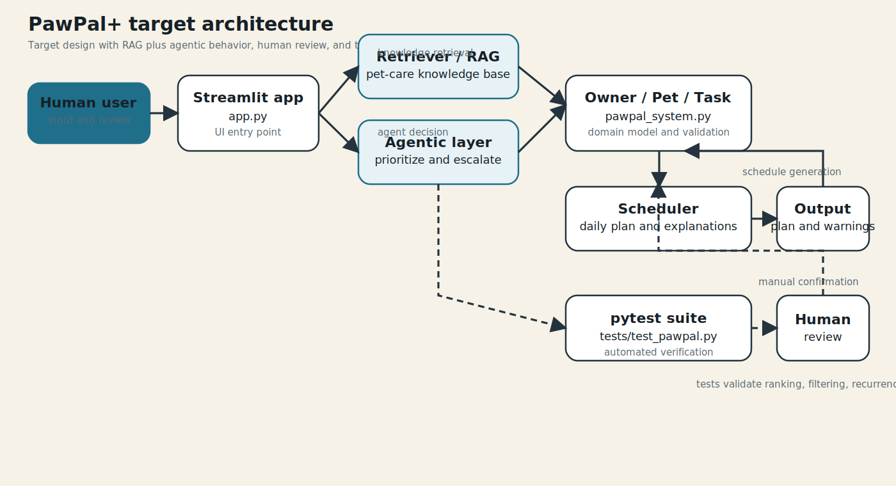

# PawPal+: AI-Assisted Pet Care Planner

## Original Project (Modules 1-3)
My original project from Modules 1-3 is **PawPal+**, an AI-assisted pet care planner that helps owners organize daily care tasks across one or more pets. The original goal was to model owner constraints, pet needs, and task priority so the system could produce explainable daily schedules instead of a static to-do list. Over the module sequence, it evolved from class design and UML into a tested scheduling engine with validation, recurrence handling, and a Streamlit interface.

## Title and Summary
PawPal+ generates practical, explainable pet-care schedules using owner time limits, task urgency, and due-time constraints. This matters because pet care is repetitive and high-stakes: missing feeding or medication can affect health, while overloading owners leads to skipped tasks. The project demonstrates how structured AI-style planning can make day-to-day routines more reliable and transparent.

## Architecture Overview
The system combines a target AI architecture view and the current implemented core:

- **Target architecture** includes a Retriever/RAG layer and an Agentic decision layer that can prioritize tasks, escalate missed medication, and recommend follow-up actions.
- **Implemented core** includes Owner/Pet/Task domain models, a deterministic Scheduler, and explanation + conflict-warning outputs.
- **Human and test checkpoints** are explicit: users review generated plans/warnings, and pytest validates ranking, filtering, recurrence, and conflict logic.

System diagram assets:

- Source diagram: `assets/pawpal_target_architecture.mmd`
- Rendered diagram: `assets/pawpal_target_architecture.svg`



## Setup Instructions
1. Clone this repository and move into the project directory.
2. Create a virtual environment.
3. Activate the environment.
4. Install dependencies from `requirements.txt`.
5. Run the Streamlit app.

```bash
git clone <your-repo-url>
cd AM_applied_ai_project-1
python -m venv .venv
source .venv/bin/activate
pip install -r requirements.txt
streamlit run app.py
```

Optional verification commands:

```bash
python main.py
python -m pytest -q
```

## Sample Interactions
Below are examples captured from a real run of `python main.py`.

### Example 1: Conflict detection
Input:
- Owner has two pets (Mochi and Whiskers) with overlapping morning tasks.

Output:
```text
⚠️ Conflict: Mochi - Feed Breakfast (08:00-08:10) overlaps with Whiskers - Feed Breakfast (08:00-08:10).
⚠️ Conflict: Mochi - Morning Walk (08:10-08:40) overlaps with Whiskers - Litter Box Cleaning (08:10-08:20).
```

### Example 2: Agent-style prioritization behavior in schedule output
Input:
- Mochi tasks include required feeding/walk tasks and one optional play task.

Output:
```text
08:00-08:10 Feed Breakfast            high       10 min
08:10-08:40 Morning Walk              high       30 min
08:40-09:10 Afternoon Walk            high       30 min
09:10-09:30 Playtime                  medium     20 min
```

### Example 3: Recurring task rollover
Input:
- Complete one daily task and one weekly task.

Output:
```text
Completed Mochi task 't2' (daily).
  Auto-created next daily task: t2-next-2026-03-29 due_date=2026-03-29 due_by=08:00
Completed Whiskers task 't6' (weekly).
  Auto-created next weekly task: t6-next-2026-04-04 due_date=2026-04-04 due_by=08:15
```

## Design Decisions and Trade-offs
- I used clear domain classes (`Owner`, `Pet`, `Task`, `Scheduler`) to keep business rules testable and separate from UI code.
- Scheduling is deterministic (required -> priority -> due time -> duration -> title), which improves explainability and repeatability.
- I kept a straightforward overlap-based conflict detector rather than a more complex optimized approach because clarity and debuggability were more important for this project scale.
- I chose string-based `HH:MM` and `YYYY-MM-DD` fields with strict validation for readability in UI/testing, accepting that richer date-time objects would be better for larger production systems.

## Testing Summary
- **Automated tests:** 32 out of 32 tests passed (`python -m pytest -q`). Coverage includes validation rules, ranking order, budget/window enforcement, sorting, filtering, recurrence rollover, and conflict detection.
- **Error handling:** invalid task/owner inputs fail fast with `ValueError` checks (duration, priority, date/time format, and invalid planning windows), which prevents silent bad state.
- **Human evaluation:** schedule outputs and conflict warnings were manually reviewed via both `python main.py` and the Streamlit UI to confirm explanations match ranking behavior.
- **Confidence scoring:** not implemented yet; reliability is currently measured through deterministic rules + automated test pass rate + human review.

Concise reliability result:

`32 out of 32 tests passed; early edge cases appeared around recurrence and overlap ordering, then stabilized after validation and targeted tests were added.`

## Reflection
This project taught me that AI-oriented problem solving is strongest when design, implementation, and verification are tightly coupled. I learned to treat explainability as a product feature, not an afterthought, by making every scheduled item include a reason and by surfacing conflicts rather than hiding them. I also learned that practical trade-offs matter: a simpler, testable approach often wins over theoretical optimization for early-stage systems.

## Demo Screenshot

